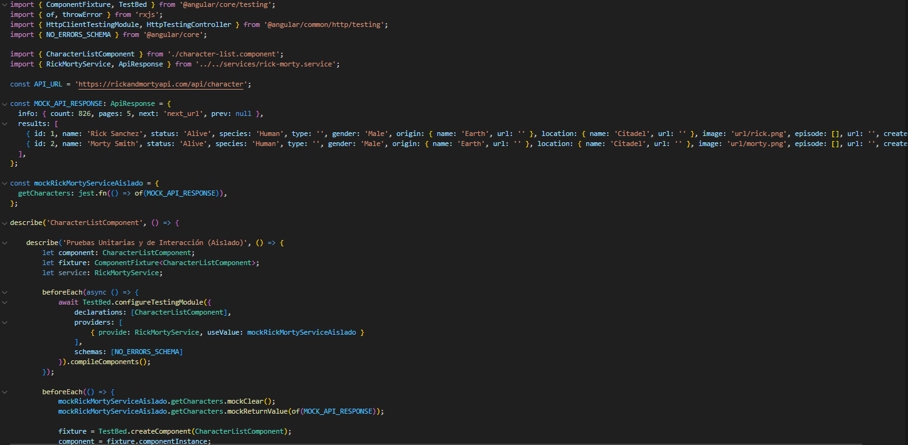

Reto curso L3: Optimizacion,Usabilidad y pruebas en Angular del 16 al 19
a)	Optimización con NgOptimizedImage
•	Ejecutemos lighthouse
 
•	Identifica la imagen que más impacta el LCP de la vista inicial.
 
•	Revisamos la imagen que mas impacta en lighthouse
 
R: La imagen que mas impacta es la primera imagen visible
 
•	Codigo
  
•	 Reemplaza su  por la directiva NgOptimizedImage, marca la imagen LCP con priority y define width/height reales.
 
•	Se ajusta el Width para que no se modifique la imagen con este cambio
•	Se ejecuta nuevamente lighthouse 

•	Para imágenes no críticas, aplica lazy-load.
Validamos las imágenes no criticas
 

Codigo
 
Aplicamos lazy-load

 
Ejecutamos nuevamente lighthouse 

•	Por ultimo añadido optimizamos también el footer

 Codigo
 
 
Modificamos para mejor optimización 

 
Ejecutamos lighthouse nuevamente

 
b)	 Usabilidad y Accesibilidad con i18n (Angular Localize)
• Ajusta la aplicación para que detecte el idioma y que se pueda cambiar a otro idioma.
Ajustamos angular.json

 
Y en el html añadimos las directivas i18n y le adjuntamos un nombre  

Ejecutamos la directiva ng extract-i18n --output-path src/locale para generar el archivo Messages.xlf
 
Se crea un nuevo archivo para que tengan las traducciones

 
Ejecutamos el comando para ver la pagina traducida al español
ng serve --configuration=es

 
Ahora ejecutamos ng serve y trae el lenguaje original (Ingles)

C) Pruebas con Jest — 3 pruebas nuevas 
Escribe 3 pruebas adicionales (pueden ser unitarias o de integración ligera) las cuales se 
sugieren los siguientes :
*Servicio con HTTP: caso de éxito (y opcional error) verificando método/URL y respuesta 
simulada.
*Creamos el archivo rick-morty.service.spec.ts

Importamos librerias- declaramos las variables que vamos a utilizar y hacemos un mock con la misma informacion de la API

Traemos la informacion necesaria para ejecutar jtest y creamos nuestro primera prueba

Creamos un segundo escenario 

Ejecutamos con jtest

*Componente: interacción del usuario y verificación del DOM con selectores accesibles. 
Creamos el archivo character-list.component.spec.ts

Importamos librerias- declaramos las variables que vamos a utilizar y hacemos un mock con la misma informacion de la API

Ejecutamos con Jtest

*Integración ligera: componente + servicio + HTTP mock. 

